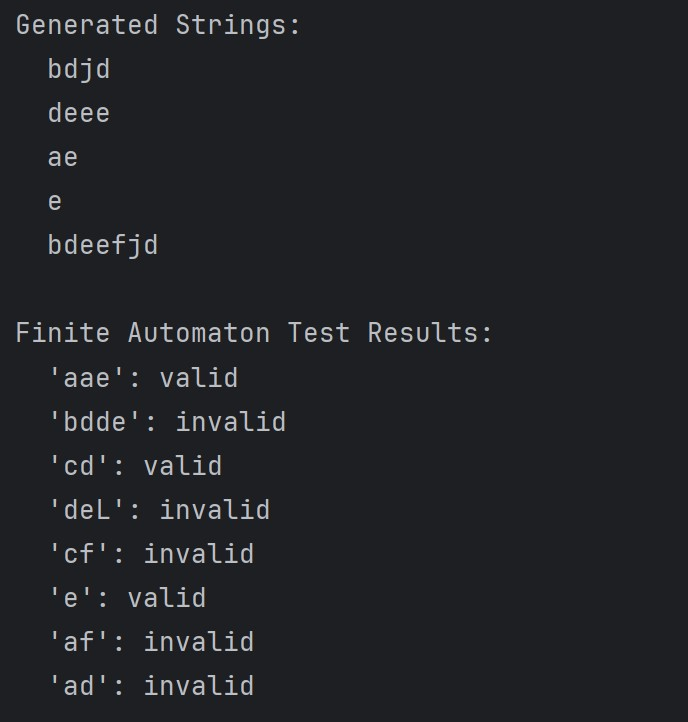

# The title of the work

### Course: Formal Languages & Finite Automata
### Author: Bujor Alexandru
### FAF-231

----

## Theory
A formal language is a set of strings made from symbols in a finite alphabet, defined by rules called a grammar. Grammars are categorized into four types (Chomsky hierarchy), with regular grammars (Type-3) being the simplest.

A finite automaton (FA) is a simple machine that processes strings and decides whether they belong to a language. It has states, transitions, a start state, and accept states.

Finite automata and regular grammars are equivalent: any regular grammar can be converted into a finite automaton, and vice versa. This makes FAs essential for tasks like pattern matching, lexical analysis, and designing compilers.

In addition, understanding these models is crucial for developing efficient algorithms in computer science, as they provide the foundation for parsing, recognizing patterns, and designing compilers. The simplicity of regular grammars allows for efficient implementation and quick analysis of strings. Finite automata offer a clear, state-based method to simulate and verify the behavior of these grammars, making them highly useful in practical applications such as text processing, search engines, and network protocol design.
## Objectives:

* Discover what a language is and what it needs to have in order to be considered a formal one;
* Provide the initial setup for the evolving project that I will work on during this semester.
* Get the grammar definition and develop a code that implements a grammar class capable of generating valid strings and converting to a finite automaton with string validation functionality.

## Implementation description

### Grammar Class
* Initialization of the grammar with non-terminals (VN), terminals (VT), production rules (P), and a start symbol (S). The rules define how symbols can be replaced to generate strings.

```
class Grammar {
    // Variant 4 definition
    private val nonTerminals: Set<String> = setOf("S", "L", "D")
    private val terminals: Set<String> = setOf("a", "b", "c", "d", "e", "f", "j")
    private val productions: Map<String, List<String>> = mapOf(
        "S" to listOf("aS", "bS", "cD", "dL", "e"),
        "L" to listOf("eL", "fL", "jD", "e"),
        "D" to listOf("eD", "d")
    )
    private val startSymbol: String = "S"
    private val maxDepth: Int = 15

    private fun _derive(symbol: String, depth: Int = 0): String {
        if (depth > maxDepth) {
            return ""
        }

        if (symbol in terminals) {
            return symbol
        }

        val prodList = productions[symbol] ?: listOf("")
        val production = prodList.random()

        return production.map { _derive(it.toString(), depth + 1) }.joinToString("")
    }
```
* generate_strings implementation generates valid strings by recursively applying production rules. It ensures uniqueness and limits string length to 15 characters.
```
    fun generateValidStrings(count: Int = 5): List<String> {
        val results = mutableSetOf<String>()
        while (results.size < count) {
            val candidate = _derive(startSymbol)
            if (candidate.isNotEmpty() && candidate.length <= maxDepth) {
                results.add(candidate)
            }
        }
        return results.toList()
    }
```

* to_finite_automaton implementation converts the grammar into a finite automaton. It creates states for non-terminals, defines transitions based on production rules, and sets the start and accept states.
```
   fun toFiniteAutomaton(): FiniteAutomaton {

        val states = mutableSetOf<String>()
        nonTerminals.forEach { states.add("q_$it") }
        states.add("q_start")
        states.add("q_accept")


        val transitions = mutableMapOf<String, MutableMap<Char, String>>()
        for (state in states) {
            transitions[state] = mutableMapOf()
        }


        for (nt in nonTerminals) {
            val state = "q_$nt"
            val prodList = productions[nt] ?: emptyList()
            for (prod in prodList) {
                if (prod.isEmpty()) continue
                val symbol = prod[0]
                val nextState = if (prod.length > 1 && prod[1].toString() in nonTerminals) {
                    "q_${prod[1]}"
                } else {
                    "q_accept"
                }
                transitions[state]!![symbol] = nextState
            }
        }


        val startProdList = productions[startSymbol] ?: emptyList()
        for (prod in startProdList) {
            if (prod.isEmpty()) continue
            val symbol = prod[0]
            val nextState = if (prod.length > 1 && prod[1].toString() in nonTerminals) {
                "q_${prod[1]}"
            } else {
                "q_accept"
            }
            transitions["q_start"]!![symbol] = nextState
        }


        val alphabet = terminals.map { it[0] }.toSet()
        return FiniteAutomaton(states, alphabet, transitions, "q_start", setOf("q_accept"))
    }
```

### FiniteAutomaton Class

* Initializes the automaton with states, an alphabet, transition rules, a start state, and accept states. These define how the automaton processes input strings.
```
  class FiniteAutomaton(
    private val states: Set<String>,
    private val alphabet: Set<Char>,
    private val transitions: Map<String, MutableMap<Char, String>>,
    private val startState: String,
    private val acceptStates: Set<String>
) ... }
```
* check_string implementation simulates the automaton by processing each symbol in the input string. It returns True if the string ends in an accept state, otherwise False.
```
fun accepts(inputString: String): Boolean {
        var currentState = startState
        for (char in inputString) {
            if (char !in alphabet) return false
            val trans = transitions[currentState] ?: return false
            if (!trans.containsKey(char)) return false
            currentState = trans[char]!!
        }
        return currentState in acceptStates
    }
```
### Main function
* Creates a Grammar object, generates 5 valid strings, converts the grammar to a finite automaton, and tests a list of strings for validity.
```
fun main() {
    val grammar = Grammar()


    val generated = grammar.generateValidStrings(5)
    println("Generated Strings:")
    for (s in generated) {
        println("  $s")
    }


    val fa = grammar.toFiniteAutomaton()
    val testSamples = listOf(
        "aae", "bdde", "cd", "deL", "cf", "e", "af", "ad"
    )
    println("\nFinite Automaton Test Results:")
    for (test in testSamples) {
        val status = if (fa.accepts(test)) "valid" else "invalid"
        println("  '$test': $status")
    }
}
```


* Output / Result:




## Conclusions
In this lab, I learned how to implement a formal grammar and a finite automaton to both generate and verify strings in a defined language. The project demonstrates how a grammar can be transformed into a finite automaton and how sample strings can be tested to determine if they conform to the language's rules. This practical exercise has clarified the theory for me and illustrated the real-world applicability of these concepts.
## References
1. Lecture notes from else